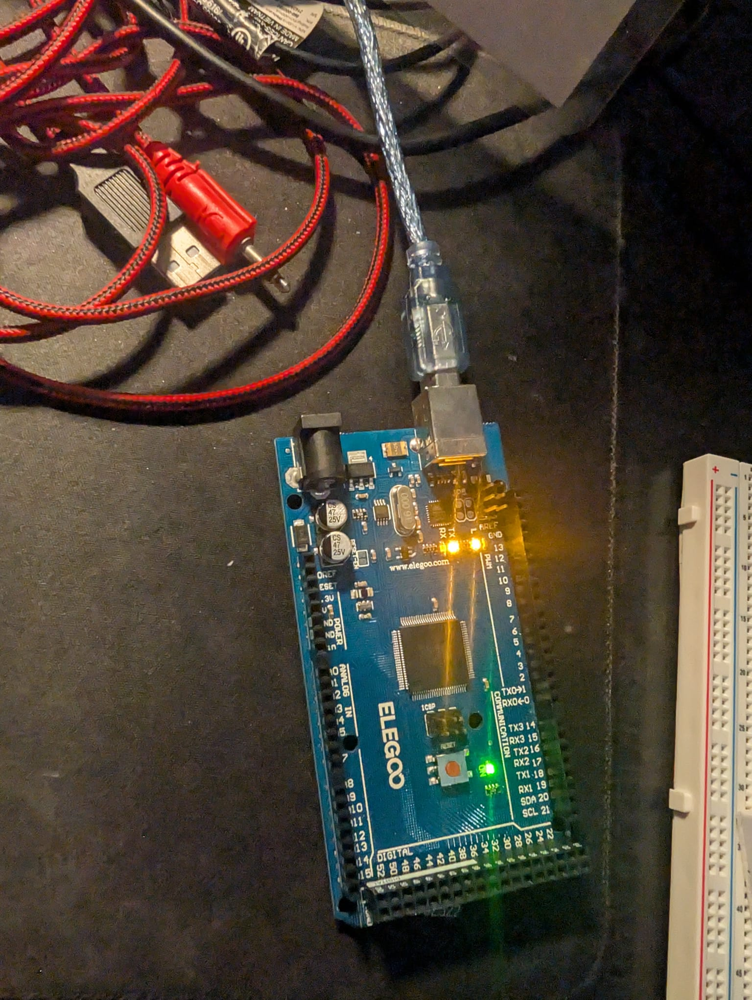

\# 01: Digital Output Basics

\## Overview

This module demonstrates the most fundamental concept of controlling a physical actuator (an LED) while simultaneously broadcasting system telemetry back to the computer using Serial communication.

\## Hardware Required 

* Arduino Mega 2560
* USB cable for Serial Communication

\## The Code Logic

1. \*\*Setup:\*\* Initializes the 'LED\_BUILTIN' (Pin 13) as an 'OUTPUT' and opens the Serial Communication channel at a baud rate of 9600.
2. \*\*Execution Loop:\*\*

   * Writes the LED pin 'HIGH' (ON).
   * Transmits the string '"System Status : LED is ON."' to the Serial Monitor.
   * Freezes for 1000 milliseconds.
   * Writes the LED pin 'LOW' (OFF).
   * Transmits '"System Status : LED is OFF."' and waits another 1000 milliseconds before repeating.

\## Media

[Click here to watch the Blink Test Video](Blink_working.mp4)