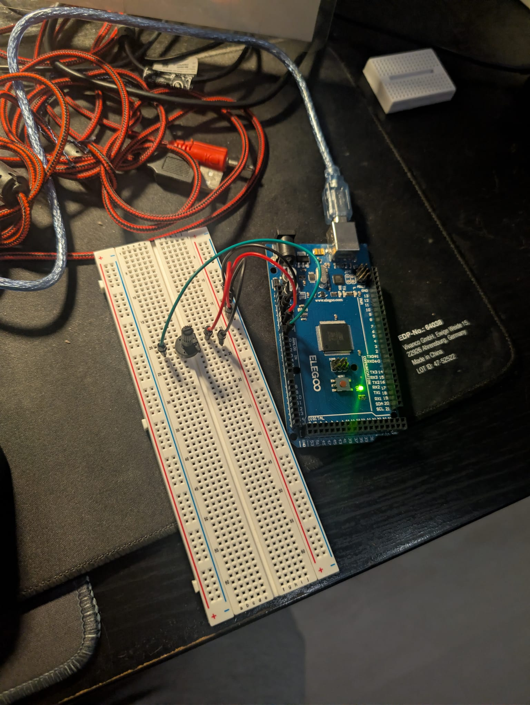

# 03 : Control Loop Logic

## Overview
This module combines both Sensing (Analog Input) and Acting (Variable Output). It reads raw telemetry from a potentiometer and mathematically maps that data to control the brightness of an LED using Pulse Width Modulation (PWM).

## Hardware Required
* Arduino Mega 2560
* 10k Ohm Rotary Potentiometer
* 5mm LED
* 220-ohm Resistor
* Breadboard and Jumper wires

## Code Logic
1. **SENSE:** Reads the 10-bit analog voltage (0-1023) from the potentiometer.
2. **THINK:** Uses the 'map()' function to proportionately scale the 0-1023 input range down to a 0-255 output range.
3. **ACT:** Uses 'analogWrite()' to send a PWM signal to the LED, adjusting its physical brightness in real-time based on the knob's position.

## Media
* 

* [Click here to watch the hardware of the Control Loop Logic](Working_of_Control_Loop_Logic.mp4)

* [Click here to watch the Serial monitor readings of Control Loop Logic](Serial_Monitor_Reading.mp4)