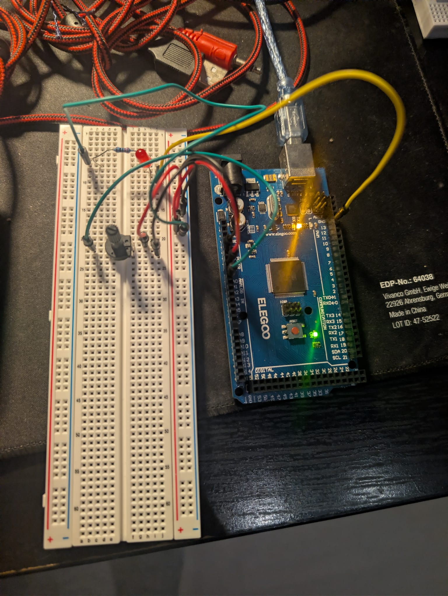

# 04: Threshold Alarm System (Safety Override)

## Overview
This module introduces conditional safety logic. It constantly monitors analog sensor telemetry and triggers a digital alarm (LED) the moment the sensor data crosses a hardcoded safety threshold.

## Hardware Required
* Arduino Mega 2560
* 10k Ohm Roatary Potentiometer (Analog Sensor)
* 5mm LED (Warning Light)
* 220-ohm Resistor
* Breadboard & Jumper Wires

## Code Logic
1. **SENSE:** Continuously reads the 10-bit analog voltage (0-1023) from the potentiometer.
2. **THINK:** Evaluates the telemetry against a hardcoded threshold (e.g., 'if (sensorValue > 800)').
3. **ACT:**
  *    If the threshold is exceeded: Writes the LED pin 'HIGH' (ON) and prints a warning to the Serial Monitor.
  * If within safe limits : Writes the LED pin 'LOW' (OFF) and prints "System Normal".

## Media
* 

* [Click here to watch the hardware of the Control Loop Logic](Working_of_Threshold_Alarm_System.mp4)

* [Click here to watch the Serial monitor readings of Control Loop Logic]